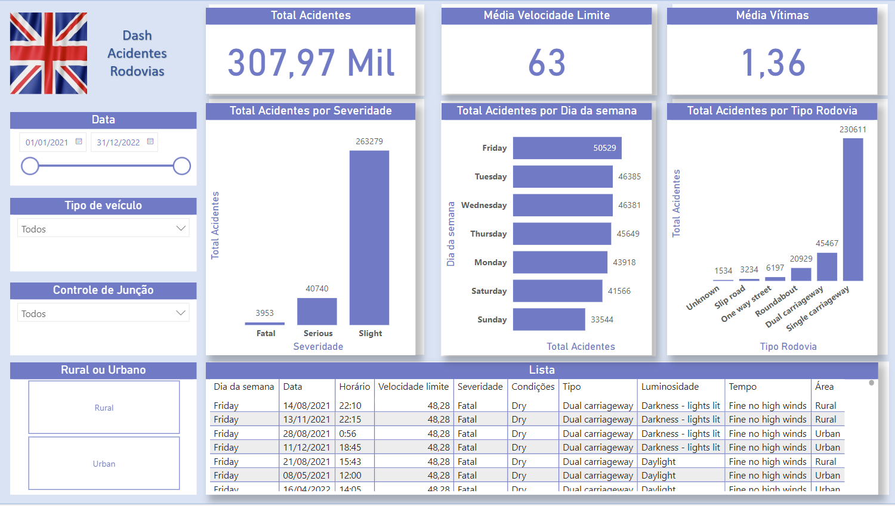

# Acidentes de carro em rodovias

O projeto consiste na análise de acidentes que ocorreram em rodovias da Inglaterra.

Para realizar o projeto respondendo as perguntas de negócio, utilizei o Python para tratamento dos dados e para fazer a análise exploratória e Power BI para visualização e interação com os dados existentes.

## Sobre os dados

A análise foi realizada utilizando a base de acidentes de carros em Kensington e Chelsea entre o mês de janeiro de 2021 e setembro de 2022, os dados foram retirados do site https://www.kaggle.com/datasets/nextmillionaire/car-accident-dataset.

## Dicionário de Dados

- **Accident_Index**: Um identificador único para cada registro de acidente.
- **Accident Date**: A data em que ocorreu o acidente (formato: DD/MM/AAAA).
- **Day_of_Week**: O dia da semana em que o acidente ocorreu.
- **Junction_Control**: Descreve o tipo de controle de cruzamento no local do acidente (por exemplo, "Ceder a passagem ou não controlado").
- **Junction_Detail**: Fornece detalhes adicionais sobre o cruzamento onde ocorreu o acidente (por exemplo, "T ou cruzamento escalonado").
- **Accident_Severity**: Indica a gravidade do acidente (por exemplo, "Grave").
- **Latitude**: A latitude geográfica do local do acidente.
- **Light_Conditions**: Descreve as condições de iluminação no momento do acidente (por exemplo, "Luz do dia").
- **Local Authority (District)**: O distrito da autoridade local onde ocorreu o acidente.
- **Carriageway_Hazards**: Descreve quaisquer perigos presentes na pista no momento do acidente (por exemplo, "Nenhum").
- **Longitude**: A longitude geográfica do local do acidente.
- **Number_of_Casualties**: O número total de vítimas envolvidas no acidente.
- **Number_of_Vehicles**: O número total de veículos envolvidos no acidente.
- **Police_Force**: A força policial que lidou com o acidente.
- **Road_Surface_Conditions**: Descreve as condições da superfície da estrada no momento do acidente (por exemplo, "Seca").
- **Road_Type**: Especifica o tipo de estrada onde ocorreu o acidente (por exemplo, "Rua de sentido único").
- **Speed_limit**: O limite de velocidade aplicável à estrada onde ocorreu o acidente.
- **Time**: A hora do dia em que o acidente aconteceu (formato: HH:MM).
- **Urban_or_Rural_Area**: Indica se o acidente ocorreu em uma área urbana ou rural.
- **Weather_Conditions**: Descreve as condições meteorológicas no momento do acidente (por exemplo, "Bom, sem ventos fortes").
- **Vehicle_Type**: Especifica o tipo de veículo envolvido no acidente (por exemplo, "Carro", "Táxi/Carro de aluguel privado").

## Apresentação

Para a apresentação, possuí duas opções:

### Dashboard:

No dashboard, pode-se conferir quais os indicadores existem para um melhor entendimento e existe a possibilidade de aplicar filtros para diferentes visões.

**[Clique para ver o dashboard](https://app.powerbi.com/view?r=eyJrIjoiYmM5M2E1YzgtZGU1Yy00NDMwLThjYTUtZTNlZDBhZWE4ODgzIiwidCI6ImE5NjgwMmM4LTA0OTAtNDI3NC1iZDVmLTA5NzIxYWQzOWRjNiJ9)**

### Apresentação em PDF:

Dentro dessa apresentação, é possível extrair insights sobre os principais causadores dos acidentes, como separação por severidade, tipo de rodovia, condições luminosas e climáticas. Após a descrição do problema, é possível verificar um plano de ação para amenizar a quantidade de acidentes.

## Ferramentas

Utilizei as seguintes ferramentas:

- **Python**: Foi utilizado para realizar a análise exploratória dos dados e tratamento da base original.
- **Power BI**: Foi utilizado para construção do dashboard.
- **PowerPoint**: Foi utilizado para montagem da apresentação.

## Perguntas respondidas

**1 - Qual o top 5 de cidades com mais acidentes?**

As 5 cidades com mais acidentes foram Birmingham, Leeds, Manchester, Bradford e Westminster

**2 - Qual a severidade dos acidentes?**

Cerca de 85,5% dos acidentes foram considerados leves, porém, existiu 13% de acidentes sérios e 1,5% de acidentes fatais, indicando que mais ou menos 15% dos acidentes tiveram uma certa gravidade.

**3 - Condições luminosas influenciaram nos acidentes?**

Podemos dizer que as condições luminosas não foram um fator, uma vez que, cerca de 74% dos acidentes aconteceram com a luz do dia existente.

**4 - Condições da rodovia influenciaram nos acidentes?**

As condições da rodovia influenciaram em cerca de 30% dos acidentes apenas, em 68% dos acidentes, a condição da pista era seca.

**5 - Qual o tipo de rodovia com mais acidentes?**

Cerca de 75% dos acidentes ocorreram em rodovias de mão única e com ambas direções.

**6 - Aconteceram mais acidentes em áreas urbanas ou rurais?**

A maior parte dos acidentes aconteceram em áreas urbanas como é de se esperar por possuir mais tráfego, com quase 200 mil acidentes.

**7 - Condições climáticas influenciam nos acidentes?**

Podemos dizer que não possui influencia, quase 80% dos acidentes aconteceram em dias normais e sem vento.

**8 - Qual dia da semana teve mais acidentes?**

O dia da semana que teve mais acidentes foi na sexta feira.

**9 - Qual tipo de veículo esteve envolvido em mais acidentes?**

Carros de passeio estiveram envolvidos em cerca de 78% dos acidentes.
